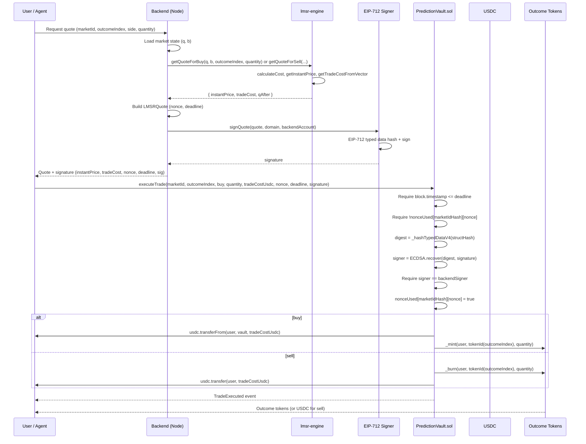

# LMSR Prediction Market: Quote to On-Chain Mint Flow

Sequence from user (or AI agent) requesting a price to on-chain execution and token minting.

## Complete Set Mint (1 YES + 1 NO for 1 USDC)

## Component Roles

| Component | Role |
|-----------|------|
| **lmsr-engine.ts** | Pure math: C(q), p_i(q), trade cost, slippage. No I/O. |
| **Backend** | Holds market state (q, b), calls LMSR, builds quote, signs with EIP-712. |
| **PredictionVault.sol** | Verifies signature, escrows USDC, mints/burns ERC1155. No logarithms. |
| **EIP-712** | Same domain and struct (LMSRQuote) in backend and contract so signature is verifiable on-chain. |
